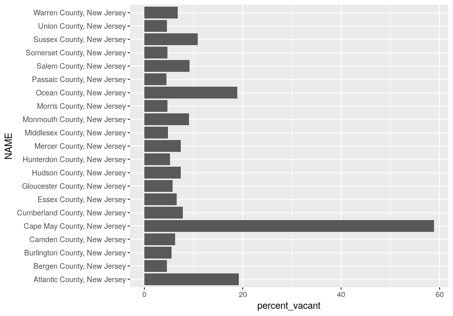
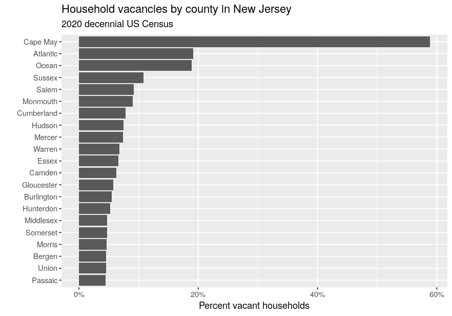
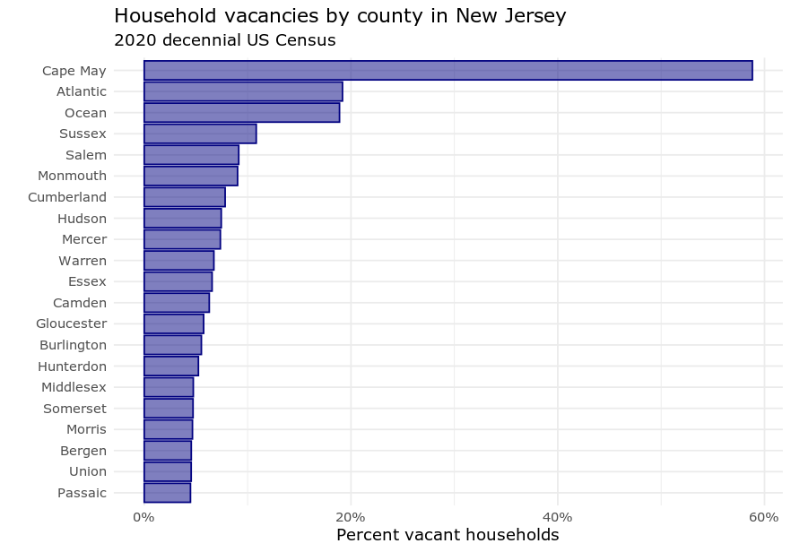

```{r setup, include=FALSE}
options(htmltools.dir.version = FALSE)
options(tigris_use_cache = TRUE)
library(tidycensus)
library(scales)


knitr::opts_chunk$set(message = FALSE, warning = FALSE, fig.dim = c(6, 5))
```

```{r xaringan-themer, include=FALSE, warning=FALSE}
library(xaringanthemer)

style_xaringan(
  title_slide_background_color = "#035004",
  text_color = "black",
  header_color = "#035004",
  inverse_background_color = "#035004",
  text_font_family = "Gotham Narrow",
  header_font_family = "Helvetica",
  header_font_weight = "bold",
  link_color = "#1a730f",
  code_inline_color = "#035004"
)
```

## About me

.pull-left[

* Associate Professor of Geography at TCU 

* Spatial data science researcher and consultant

* R package developer: __tidycensus__, __tigris__, __mapboxapi__

* Book: [_Analyzing US Census Data: Methods, Maps and Models in R_](https://walker-data.com/census-r/)
  - Available for free online right now;
  - To be published in print with CRC Press in fall 2022

]

.pull-right[


]

---

## SSDAN workshop series

* Today: an introduction to 2020 US Census data

* Next Friday (March 18): Mapping 2020 Census data

* Friday, March 25: a first look at the 2016-2020 American Community Survey data with R and __tidycensus__

---

## Today's agenda

* Hour 1: Getting started with 2020 Census data in __tidycensus__

* Hour 2: Wrangling Census data with __tidyverse__ tools

* Hour 3: Visualizing 2020 US Census data

---
class: middle, center, inverse

## Part 1: Getting started with 2020 Census data in tidycensus

---

## Typical Census data workflows


---

## The Census API

* [The US Census __A__pplication __P__rogramming __Interface__ (API)](https://www.census.gov/data/developers/data-sets.html) allows developers to access Census data resources programmatically

* R packages to interact with the APIs: censusapi, acs

* Other languages: cenpy (Python), citySDK (JavaScript)

---

## tidycensus

* R interface to the Decennial Census, American Community Survey, Population Estimates Program, and Public Use Microdata Series APIs

* Key features: 
  - Wrangles Census data internally to return tidyverse-ready format (or traditional wide format if requested);
  
  - Automatically downloads and merges Census geometries to data for mapping (next week's workshop!); 
  
  - Includes tools for handling margins of error in the ACS and working with survey weights in the ACS PUMS;
  
  - States and counties can be requested by name (no more looking up FIPS codes!)
  
---

## Development of tidycensus

* Mid-2010s: I started accumulating R scripts that did the same thing over and over (download Census data from the API, transform to tidy format, join to spatial data)

* (Very) early implementation: [acs14lite](https://rpubs.com/walkerke/acs14lite)

* 2017: first release of tidycensus following the implementation of a "tidy spatial data model" in the sf package

* 2020: Matt Herman joins as co-author; support for ACS microdata (PUMS) in tidycensus

---

## Getting started with tidycensus

* To get started, install the packages you'll need for today's workshop

* If you are using the RStudio Cloud environment, these packages are already installed for you

```{r install-packages, eval = FALSE}
install.packages(c("tidycensus", "tidyverse"))
```

---

## Your Census API key

* To use tidycensus, you will need a Census API key.  Visit https://api.census.gov/data/key_signup.html to request a key, then activate the key from the link in your email.  

* Once activated, use the `census_api_key()` function to set your key as an environment variable

```{r api-key, eval = FALSE}
library(tidycensus)

census_api_key("YOUR KEY GOES HERE", install = TRUE)
```

---
class: middle, center, inverse

## Basic usage of tidycensus

---

## 2020 Census data: what we have now

* The currently available 2020 Census data come from the PL94-171 Redistricting Summary File, which is used for congressional apportionment & redistricting

* Variables available include total counts (population & households), occupied / vacant housing units, total and voting-age population breakdowns by race & ethnicity, and group quarters status

* Later in 2022 (expected): the Demographic and Housing Characteristics summary files, which will include other variables typically included in the decennial Census data (age & sex breakdowns, detailed race & ethnicity)

---

## 2020 Census data in tidycensus

* The `get_decennial()` function is used to acquire data from the decennial US Census

* The two required arguments are `geography` and `variables` for the functions to work; for 2020 Census data, use `year = 2020`.  

```{r decennial}
pop20 <- get_decennial(
  geography = "state",
  variables = "P1_001N",
  year = 2020
)
```

---

* Decennial Census data are returned with four columns: `GEOID`, `NAME`, `variable`, and `value`

```{r view-decennial}
pop20
```

---

## Understanding the printed messages

* When we run `get_decennial()` for the 2020 Census for the first time, we see the following messages:

```
Getting data from the 2020 decennial Census
Using the PL 94-171 Redistricting Data summary file
Note: 2020 decennial Census data use differential privacy, a technique that
introduces errors into data to preserve respondent confidentiality.
ℹ Small counts should be interpreted with caution.
ℹ See https://www.census.gov/library/fact-sheets/2021/protecting-the-confidentiality-of-the-2020-census-redistricting-data.html for additional guidance.
This message is displayed once per session.
```

---

## Understanding the printed messages

* The Census Bureau is using _differential privacy_ in an attempt to preserve respondent confidentiality in the 2020 Census data, which is required under US Code Title 13

* Intentional errors are introduced into data, impacting the accuracy of small area counts (e.g. some blocks with children, but no adults)

* Advocates argue that differential privacy is necessary to satisfy Title 13 requirements given modern database reconstruction technologies; critics contend that the method makes data less useful with no tangible privacy benefit


---

## Requesting tables of variables

* The `table` parameter can be used to obtain all related variables in a "table" at once

```{r census-table}
table_p2 <- get_decennial(
  geography = "state", 
  table = "P2", #<<
  year = 2020
)
```

---

```{r view-table}
table_p2
```

---
class: middle, center, inverse

## Understanding geography and variables in tidycensus

---

## US Census Geography


.footnote[Source: [US Census Bureau](https://www2.census.gov/geo/pdfs/reference/geodiagram.pdf)]

---

## Geography in tidycensus

* Information on available geographies, and how to specify them, can be found [in the tidycensus documentation](https://walker-data.com/tidycensus/articles/basic-usage.html#geography-in-tidycensus-1)


---

## Querying by state

.pull-left[

* For geographies available below the state level, the `state` parameter allows you to query data for a specific state

* __tidycensus__ translates state names and postal abbreviations internally, so you don't need to remember the FIPS codes!

* Example: data on the Hispanic population in Michigan by county

]

.pull-right[

```{r query-by-state}
mi_hispanic <- get_decennial(
  geography = "county", 
  variables = "P2_002N", 
  state = "MI", #<<
  year = 2020
)
```

]

---

```{r show-query-by-state}
mi_hispanic
```


---

## Querying by state and county

* County names are also translated internally by __tidycensus__ for sub-county queries, e.g. for Census tracts, block groups, and blocks

```{r query-by-county}
washtenaw_hispanic <- get_decennial(
  geography = "tract", 
  variables = "P2_002N", 
  state = "MI", 
  county = "Washtenaw", #<<
  year = 2020
)
```

---

```{r show-query-by-county}
washtenaw_hispanic
```


---

## Searching for variables

* To search for variables, use the `load_variables()` function along with a year and dataset

* The `View()` function in RStudio allows for interactive browsing and filtering

```{r search-variables, eval = FALSE}
vars <- load_variables(2020, "pl")

View(vars)

```

---

## Tables available in the 2020 Census PL file

* H1: Occupancy status (by household)

* P1: Race

* P2: Race by Hispanic origin

* P3: Race for the population 18+

* P4: Race by Hispanic origin for the population 18+

* P5: Group quarters status

---
class: middle, center, inverse

## Data structure in tidycensus

---

## "Tidy" or long-form data

.pull-left[

* The default data structure returned by __tidycensus__ is "tidy" or long-form data, with variables by geography stacked by row

]

.pull-right[


```{r tidy-data}
group_quarters <- get_decennial(
  geography = "state", 
  table = "P5", 
  year = 2020
)

```

]

---

```{r show-tidy-data}
group_quarters
```


---

## "Wide" data 

.pull-left[

* The argument `output = "wide"` spreads Census variables across the columns, returning one row per geographic unit and one column per variable

]

.pull-right[

```{r wide-data}
group_quarters_wide <- get_decennial(
  geography = "state", 
  table = "P5",
  year = 2020,
  output = "wide" #<<
)
```

]

---

```{r show-wide-data}
group_quarters_wide
```


---

## Using named vectors of variables

.pull-left[

* Census variables can be hard to remember; using a named vector to request variables will replace the Census IDs with a custom input

* In long form, these custom inputs will populate the `variable` column; in wide form, they will replace the column names

]

.pull-right[


```{r named-variables}
vacancies_wide <- get_decennial(
  geography = "county",
  state = "MI",
  variables = c(vacant_households = "H1_003N", #<<
                total_households = "H1_001N"), #<<
  output = "wide",
  year = 2020
)
```

]

---

```{r show-named-variables}
vacancies_wide
```


---

## Part 1 exercises

1. Review the available geographies in tidycensus from the tidycensus documentation.  Acquire data on total households (variable `H1_001N`) for a geography we have not yet used.  

2. Use the `load_variables()` function to find a variable that interests you that we haven't used yet.  Use `get_decennial()` to fetch data from the 2020 Census for counties in a state of your choosing.

---
class: middle, center, inverse

## Part 2: Wrangling Census data with tidyverse tools

---

## The tidyverse

```{r tidyverse}
library(tidyverse)

tidyverse_logo()
```

* The [tidyverse](https://tidyverse.tidyverse.org/index.html): an integrated set of packages developed primarily by Hadley Wickham and the RStudio team

---

## tidycensus and the tidyverse

* Census data are commonly used in _wide_ format, with categories spread across the columns

* tidyverse tools work better with [data that are in "tidy", or _long_ format](https://vita.had.co.nz/papers/tidy-data.pdf); this format is returned by tidycensus by default

* Goal: return data "ready to go" for use with tidyverse tools

---
class: middle, center, inverse

## Exploring 2020 Census data with tidyverse tools

---

## Finding the largest values

* dplyr's `arrange()` function sorts data based on values in one or more columns, and `filter()` helps you query data based on column values

* Example: what are the largest and smallest counties in Texas by population?

```{r texas-population}
library(tidycensus)
library(tidyverse)

tx_population <- get_decennial(
  geography = "county",
  variables = "P1_001N",
  year = 2020,
  state = "TX"
)

```

---

```{r sort-ascending}
arrange(tx_population, value)

```

---

```{r sort-descending}
arrange(tx_population, desc(value))
```

---

## What are the counties with a population below 1,000?

* The `filter()` function subsets data according to a specified condition, much like a SQL query

```{r filter-below-1000}
below1000 <- filter(tx_population, value < 1000)

below1000
```
---

## Using summary variables

* Many decennial Census and ACS variables are organized in tables in which the first variable represents a _summary variable_, or denominator for the others

* The parameter `summary_var` can be used to generate a new column in long-form data for a requested denominator, which works well for normalizing estimates

---

## Using summary variables

```{r summary-variable}
race_vars <- c(
  Hispanic = "P2_002N",
  White = "P2_005N",
  Black = "P2_006N",
  Native = "P2_007N",
  Asian = "P2_008N",
  HIPI = "P2_009N"
)

az_race <- get_decennial(
  geography = "county",
  state = "AZ",
  variables = race_vars,
  summary_var = "P2_001N",
  year = 2020
)
```

---

```{r view-summary-variable}
az_race
```

---

## Normalizing columns with `mutate()`

* dplyr's `mutate()` function is used to calculate new columns in your data; the `select()` column can keep or drop columns by name

* In a tidyverse workflow, these steps are commonly linked using the pipe operator (`%>%`) from the magrittr package

```{r mutate-and-select}
az_race_percent <- az_race %>%
  mutate(percent = 100 * (value / summary_value)) %>%
  select(NAME, variable, percent)
```


---

```{r view-percent}
az_race_percent
```

---
class: middle, center, inverse

## Group-wise Census data analysis

---

## Group-wise Census data analysis

* The `group_by()` and `summarize()` functions in dplyr are used to implement the split-apply-combine method of data analysis

* The default "tidy" format returned by tidycensus is designed to work well with group-wise Census data analysis workflows

---

## What is the largest group by county?

```{r largest-group}
largest_group <- az_race_percent %>%
  group_by(NAME) %>%
  filter(percent == max(percent))
```

---

```{r view-largest-group}
largest_group
```

---

## What are the median percentages by group?

```{r median-by-group}
az_race_percent %>%
  group_by(variable) %>%
  summarize(median_pct = median(percent))
```

---
class: middle, center, inverse

## Analyzing change since 2010

---

## How have areas changed since the 2010 Census?

* A common use-case for the 2020 decennial Census data is to assess change over time

* For example: which areas have experienced the most population growth, and which have experienced the steepest declines?

* __tidycensus__ allows users to access the 2000 and 2010 decennial Census data for comparison, though variable IDs will differ

---

## Getting data from the 2010 Census

```{r get-2010-data}
county_pop_10 <- get_decennial(
  geography = "county",
  variables = "P001001", #<<
  year = 2010 #<<
)

county_pop_10
```

---

## Cleanup before joining

* The `select()` function can both subset datasets by column and rename columns, "cleaning up" a dataset before joining to another dataset

```{r clean-2010-data}
county_pop_10_clean <- county_pop_10 %>%
  select(GEOID, value10 = value) #<<

county_pop_10_clean
```

---

## Joining data

* In __dplyr__, joins are implemented with the `*_join()` family of functions

```{r join-data}
county_pop_20 <- get_decennial(
  geography = "county",
  variables = "P1_001N",
  year = 2020
) %>%
  select(GEOID, NAME, value20 = value)

county_joined <- county_pop_20 %>%
  left_join(county_pop_10_clean, by = "GEOID") #<<
```

---

```{r show-joined-data}
county_joined
```


---

## Calculating change

* __dplyr__'s `mutate()` function can be used to calculate new columns, allowing for assessment of change over time

```{r calculate-change}
county_change <- county_joined %>%
  mutate( #<<
    total_change = value20 - value10, #<<
    percent_change = 100 * (total_change / value10) #<<
  ) #<<

```

---

```{r show-change}
county_change
```


---

## Caveat: changing geographies!

* County names and boundaries can change from year to year, introducing potential problems in time-series analysis

* This is particularly acute for small geographies like Census tracts & block groups, which we'll cover on March 25!

```{r show-unmatched-areas}
filter(county_change, is.na(value10))
```


---

## Part 2 exercises

With the `county_change` object, use __tidyverse__ tools to answer these questions:

* Which counties gained and lost the most people during the 2010s?

* How many counties in the US grew by 40 percent or more during the 2010s?

* How many counties in the US lost 20 percent or more of their populations during the 2010s?

---
class: middle, center, inverse

## Part 3: Visualizing US Census data

---

## Visualizing US Census data

* __tidycensus__ is designed with ggplot2-based visualization in mind, the core framework for data visualization in the tidyverse

* ggplot2 along with its extensions can be used for everything from simple graphics to complex interactive plots

---

## Data setup: Hispanic population by county in Georgia

```{r get-georgia-data}
library(tidycensus)
library(tidyverse)

ga_hispanic <- get_decennial(
  geography = "county", 
  variables = c(total = "P2_001N",
                hispanic = "P2_002N"), 
  state = "GA",
  year = 2020,
  output = "wide"
) %>%
  mutate(percent = 100 * (hispanic / total))
```

---

```{r show-georgia-data}
ga_hispanic
```

---

## Exploring data with visualization

.pull-left[

* Graphics in __ggplot2__ are initialized with the `ggplot()` function, in which a user typically supplies a dataset and aesthetic mapping with `aes()`

* Graphical elements are then "layered" onto the ggplot object, consisting of a "geom", or geometric object (`geom_*()`) and custom styling elements linked with the `+` operator

* Histograms can be created with `geom_histogram()`; the `bins` argument controls the number of bins on the plot

]


.pull-right[

```{r histogram}
ggplot(ga_hispanic, aes(x = percent)) + 
  geom_histogram(bins = 10)
```


]

---

## Univariate visualization

.pull-left[

* Other univariate visualization methods in __ggplot2__ include `geom_boxplot()` for box and whisker plots, `geom_density()` for kernel density plots, and `geom_violin()` for violin plots

]

.pull-right[

```{r boxplot}
ggplot(ga_hispanic, aes(x = percent)) + 
  geom_boxplot() #<<
```

]

---

# Multivariate visualization

.pull-left[

* A second variable can be mapped to the second axis for visualization of multivariate relationships

* A _scatterplot_ is commonly used to visualize the joint distributions of two quantitative variables, implemented with `geom_point()`.  

]

.pull-right[

```{r scatterplot}
options(scipen = 999) # Disable scientific notation

ggplot(ga_hispanic, aes(x = total, y = percent)) + 
  geom_point()
```


]

---

## Layering multiple geoms

.pull-left[

* Multiple geoms can be represented on the same plot by adding additional calls to `geom_*()` to the graphic's code

* Shown here: a regression line superimposed over the scatterplot to show the linear relationship

]

.pull-right[

```{r scatterplot-with-lm}
ggplot(ga_hispanic, aes(x = total, y = percent)) + 
  geom_point() + 
  geom_smooth(method = "lm") #<<
```

]


---

## Modifying axis scales

.pull-left[

* In many cases, the baseline populations of Census units will vary dramatically (counties in Georgia have populations ranging from 1500 to 1 million)

* Changing a scale from linear to logarithmic can help with exploratory visualization when data is heavily skewed in this way

]

.pull-right[

```{r scatterplot-with-log-axis}
ggplot(ga_hispanic, aes(x = total, y = percent)) + 
  geom_point() + 
  scale_x_log10() + #<<
  geom_smooth()
```


]


---
class: middle, center, inverse

# Customizing styling of Census plots with ggplot2

---

* Prompt: comparing vacant household percentages by county in a state

```{r nj-vacancies}
nj_vacancies <- get_decennial(
  geography = "county",
  variables = c(total_households = "H1_001N",
                vacant_households = "H1_003N"),
  state = "NJ",
  year = 2020,
  output = "wide"
) %>%
  mutate(percent_vacant = 100 * (vacant_households / total_households))
```

---

## Comparative plots

* A categorical variable (rather than a numeric one) can be mapped to the second axis to compare Census data by category (e.g. by county)

```{r first-bar-chart, eval = FALSE}
ggplot(nj_vacancies, aes(x = percent_vacant, y = NAME)) + 
  geom_col()
```

---



---

## Improving your plot

* In the code below, we format the axis tick labels with functions and apply custom labels to chart elements like the axis and plot titles

```{r second-bar-chart, eval = FALSE}
library(scales)

ggplot(nj_vacancies, aes(x = percent_vacant, y = reorder(NAME, percent_vacant))) +
  geom_col() + 
  scale_x_continuous(labels = label_percent(scale = 1)) + #<<
  scale_y_discrete(labels = function(y) str_remove(y, " County, New Jersey")) + #<<
  labs(x = "Percent vacant households", #<<
       y = "", #<<
       title = "Household vacancies by county in New Jersey", #<<
       subtitle = "2020 decennial US Census") #<<

```


---



---

## Styling your plot

* Once you have settled on a general format, you can style the plot to your liking with fonts, colors and more!

```{r third-bar-chart, eval = FALSE}
ggplot(nj_vacancies, aes(x = percent_vacant, y = reorder(NAME, percent_vacant))) +
  geom_col(fill = "navy", color = "navy", alpha = 0.5) + #<<
  theme_minimal(base_family = "Verdana") + #<<
  scale_x_continuous(labels = label_percent(scale = 1)) + 
  scale_y_discrete(labels = function(y) str_remove(y, " County, New Jersey")) + 
  labs(x = "Percent vacant households",
       y = "",
       title = "Household vacancies by county in New Jersey",
       subtitle = "2020 decennial US Census")
```

---



---
class: middle, center, inverse

## Visualizing group-wise comparisons

---

* Prompt: how do the distributions of percentage Black population by Census tract vary among the five boroughs of New York City?

```{r get-nyc-data}
nyc_percent_black <- get_decennial(
  geography = "tract",
  variables = "P2_006N",
  summary_var = "P2_001N",
  state = "NY",
  county = c("New York", "Kings",
             "Queens", "Bronx",
             "Richmond"),
  year = 2020
) %>%
  mutate(percent = 100 * (value / summary_value))
```

---

```{r show-nyc-data}
nyc_percent_black
```

---

## Separating columns

* The `separate()` function splits values in a single column into multiple columns

* This function can be used to parse the `NAME` column returned by __tidycensus__ to obtain tract, county, and state information

```{r separate-nyc-data}
nyc_percent_black2 <- nyc_percent_black %>%
  separate(NAME, into = c("tract", "county", "state"),
           sep = ", ")
```

---

```{r show-separated-nyc-data}
nyc_percent_black2
```


---

## Visualizing data by group

.pull-left[

* Mapping a categorical variable to the `fill` or `color` aesthetics (depending on the geom used) will draw one geom per category on the plot

]

.pull-right[

```{r overlapping-density-plots}
ggplot(nyc_percent_black2, 
       aes(x = percent, fill = county)) + 
  geom_density(alpha = 0.3)
```


]


---

## Faceted visualization

* The `facet_wrap()` function splits plots into separate panels by category, creating "small multiples" visualizations that are excellent for making comparisons

```{r faceted-plots, eval = FALSE}
ggplot(nyc_percent_black2, aes(x = percent)) +
  geom_density(fill = "darkgreen", color = "darkgreen", alpha = 0.5) + 
  facet_wrap(~county) + #>>
  scale_x_continuous(labels = function(x) paste0(x, "%")) + #>>
  theme_minimal(base_size = 14) + #>>
  theme(axis.text.y = element_blank()) + #>>
  labs(x = "Percent Black", #>>
       y = "", #>>
       title = "Black population shares by Census tract, 2020") #>>
```

---


---

## Ridgeline plots

* The __ggridges__ package implements _ridgeline plots_, which visualize overlapping density plots among categories

```{r ridgeline-plots, eval = FALSE}
library(ggridges)

ggplot(nyc_percent_black2, aes(x = percent, y = county)) + 
  geom_density_ridges() + 
  theme_ridges() + 
  labs(x = "Percent Black, 2020 (by Census tract)", 
       y = "") + 
  scale_x_continuous(labels = scales::label_percent(scale = 1))
```

---


---
class: middle, center, inverse

## Advanced example: geo-faceted plots

---

## ggplot2 extensions

* [Highly customized Census data visualizations are possible with extensions to ggplot2](https://exts.ggplot2.tidyverse.org/gallery/)


---

## Step 1: acquire data for all Census tracts in the US

```{r get-us-data, eval = FALSE}

us_percent_white <- map_dfr(c(state.abb, "DC"), function(state) {
  get_decennial(
    geography = "tract",
    variables = "P2_005N",
    summary_var = "P2_001N",
    state = state,
    year = 2020
  ) %>%
    mutate(percent = 100 * (value / summary_value)) %>%
    separate(NAME, into = c("tract", "county", "state"),
             sep = ", ")
})

```

---

## Step 2: build a geo-faceted plot

```{r geofaceted-plot, eval = FALSE}
library(geofacet)

ggplot(us_percent_white, aes(x = percent)) + 
  geom_histogram(fill = "navy", alpha = 0.8, bins = 30) + 
  theme_minimal() + 
  scale_fill_manual(values = c("darkred", "navy")) + 
  facet_geo(~state, grid = "us_state_grid2",
            label = "code", scales = "free_y") + 
  theme(axis.text = element_blank(),
        strip.text.x = element_text(size = 8)) + 
  labs(x = "", 
       y = "", 
       title = "Non-Hispanic white population shares among Census tracts", 
       fill = "", 
       caption = "Data source: 2020 decennial US Census & tidycensus R package\nX-axes range from 0% white (on the left) to 100% white (on the right).  Y-axes are unique to each state.")
```

---


---

## Part 3 exercises

* Choose one of the example charts and try customizing its appearance.  Some tips on styling are found at https://ggplot2.tidyverse.org/articles/ggplot2-specs.html.  

* Try customizing the New Jersey vacancies example for a different variable (challenge: express it as an appropriate percentage!) and a different state.

---
class: middle, center, inverse

## Thank you!
