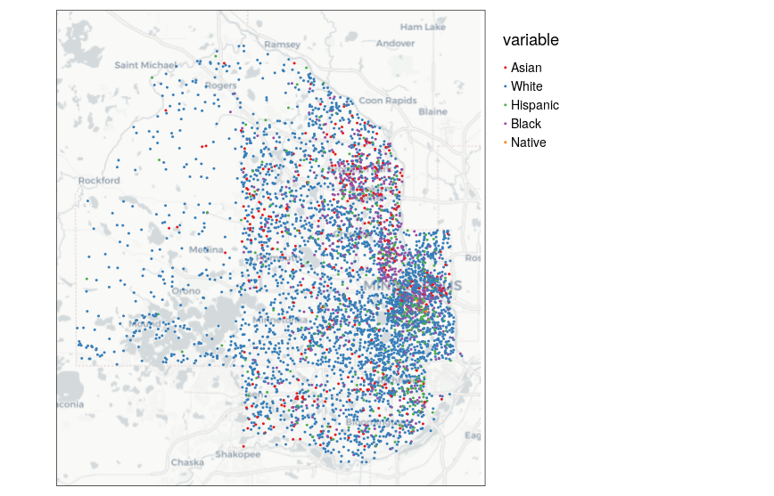

```{r setup, include=FALSE}
options(htmltools.dir.version = FALSE)
options(tigris_use_cache = TRUE)
library(tigris)
library(tmap)
library(sf)
tmap_options(legend.text.size = 1)

knitr::opts_chunk$set(message = FALSE, warning = FALSE, fig.width = 12)
```

```{r xaringan-themer, include=FALSE, warning=FALSE}
library(xaringanthemer)

style_xaringan(
  title_slide_background_color = "#035004",
  text_color = "black",
  header_color = "#035004",
  inverse_background_color = "#035004",
  text_font_family = "Gotham Narrow",
  header_font_family = "Helvetica",
  header_font_weight = "bold",
  link_color = "#1a730f",
  code_inline_color = "#035004"
)
```

## About me

.pull-left[

* Associate Professor of Geography at TCU 

* Spatial data science researcher and consultant

* R package developer: __tidycensus__, __tigris__, __mapboxapi__

* Book: [_Analyzing US Census Data: Methods, Maps and Models in R_](https://walker-data.com/census-r/)
  - Available for free online right now;
  - To be published in print with CRC Press in fall 2022

]

.pull-right[


]

---

## SSDAN workshop series

* Last week: an introduction to 2020 US Census data
  - [If you missed the workshop, view the slides here](https://walker-data.com/umich-workshop-2022/intro-2020-census/#1)

* __Right now__: Mapping 2020 Census data

* Friday, March 25: a first look at the 2016-2020 American Community Survey data with R and __tidycensus__

---

## Today's agenda

* Hour 1: Census geographic data and "GIS" in R

* Hour 2: Making maps with 2020 US Census data

* Hour 3: Interactive mapping and advanced geometry handling

---

## General setup

* Packages required for today's workshop:

```{r install-packages, eval = FALSE}
install.packages(c("tidycensus", "tidyverse", "terra",
                   "tmap", "mapview", "rosm"))
```

* Other required packages will be picked up as dependencies of these packages

* Or use the pre-built RStudio Cloud environment at https://rstudio.cloud/project/3705005

---
class: middle, center, inverse

## Part 1: Census geographic data and "GIS" in R

---

## US Census Geography


.footnote[Source: [US Census Bureau](https://www2.census.gov/geo/pdfs/reference/geodiagram.pdf)]

---

## Census TIGER/Line shapefiles

.pull-left[


]

.pull-right[

* TIGER: Topologically Integrated Geographic Encoding and Referencing database

* High-quality series of geographic datasets released by the US Census Bureau

* Distributed as _shapefiles_, a common GIS data format comprised of several related files

]

.footnote[Image source: [US Census Bureau](https://www2.census.gov/geo/pdfs/maps-data/data/tiger/tgrshp2020/TGRSHP2020_TechDoc.pdf)]
---

## A typical GIS workflow


---

## The __tigris__ R package

.pull-left[

]

.pull-right[

* R interface to the US Census Bureau's TIGER/Line shapefile FTP server

* No API key necessary - just install the package and start using Census shapefiles in R!

]

---

## Basic usage of tigris

* To use tigris, call a function that corresponds to the Census geography you want, optionally by `state` or `county`, when appropriate

* Defaults to 2020 unless `year` is otherwise specified (up to 2021 is available)

```{r basic-usage}
tx_counties <- counties(state = "TX")
```

---

```{r show-tx-counties}
tx_counties
```

---

```{r basic-plot}
plot(tx_counties$geometry)
```

---

## The __sf__ package and simple feature geometry

.pull-left[


]

.pull-right[

* The sf package implements a _simple features data model_ for vector spatial data in R

* Vector geometries: _points_, _lines_, and _polygons_ stored in a list-column of a data frame

* Allows for tidy spatial data analysis 

]

---
class: middle, center, inverse

## Discussion: Making sense of GIS data

---

## Datasets available in tigris

* __Legal entities__: units that have legal significance in the US (e.g. states, counties)

* __Statistical entities__: units that are used to tabulate Census data but do not have legal standing (e.g. Census tracts or block groups)

* __Geographic features__: other geographic datasets provided by the Census Bureau that are not used for demographic tabulation (e.g. roads, water)

---

## Polygons: statistical entities

```{r travis-tracts}
travis_tracts <- tracts(state = "TX", county = "Travis")

plot(travis_tracts$geometry)
```

---

## Lines: geographic features

```{r travis-roads}
travis_roads <- roads(state = "TX", county = "Travis")

plot(travis_roads$geometry)
```

---

## Points: geographic features

```{r dc-landmarks}
dc_landmarks <- landmarks("DC", type = "point")

plot(dc_landmarks$geometry)
```


---

## How tigris works

When you call a tigris function, it does the following: 

* _Downloads_ your data from the US Census Bureau website; 

* _Stores_ your data in a temporary directory by default; 

* _Loads_ your data into R as a simple features object using `sf::st_read()`

* Recommended option: use `options(tigris_use_cache = TRUE)` to cache downloaded shapefiles and prevent having to re-download every time you use them

---
class: middle, center, inverse

## tigris features and options

---

## Cartographic boundary shapefiles

.pull-left[
* Question I've received over the years: "Why does Michigan look so weird?"

* The core TIGER/Line shapefiles include _water area_ that belongs to US states and counties

]

.pull-right[
```{r michigan-tiger}
mi_counties <- counties("MI")

plot(mi_counties$geometry)
```
]


---

## Cartographic boundary shapefiles


.pull-left[
* Use the argument `cb = TRUE` to obtain a _cartographic boundary shapefile_ pre-clipped to the US shoreline

* For some geographies, highly generalized (1:5 million and 1:20 million) shapefiles are available with the `resolution` argument
]

.pull-right[
```{r michigan-cb}
mi_counties_cb <- counties("MI", cb = TRUE)

plot(mi_counties_cb$geometry)
```
]

---

## Understanding yearly differences in TIGER/Line files

* Whereas legal entities change shape very rarely (but they do change!), statistical entities change with every decennial Census

* tigris fetches Census shapefiles from 1990 up through 2020

```{r get-yearly-data}
tarrant90 <- tracts("TX", "Tarrant", cb = TRUE, year = 1990)
tarrant00 <- tracts("TX", "Tarrant", cb = TRUE, year = 2000)
tarrant10 <- tracts("TX", "Tarrant", cb = TRUE, year = 2010)
tarrant20 <- tracts("TX", "Tarrant", cb = TRUE, year = 2020)

```
---

```{r plot-yearly-data}
par(mfrow = c(2, 2))

plot(tarrant90$geometry, main = "1990")
plot(tarrant00$geometry, main = "2000")
plot(tarrant10$geometry, main = "2010")
plot(tarrant20$geometry, main = "2020")


```

---

## Interactive viewing of data with __mapview__

* The mapview package brings interactive spatial data viewing to R:

```{r mapview, eval = FALSE}
library(mapview)

mapview(tarrant20)
```

* As an extension, use the leafsync package to interactively compare two or more maps

```{r sync, eval = FALSE}
library(leafsync)

sync(mapview(tarrant90), mapview(tarrant20))

```

---

## National datasets

* National enumeration units datasets for select geographies (counties, Census tracts, block groups) can be acquired when `cb = TRUE` by leaving the `state` argument blank

```{r all-tracts}
us_tracts <- tracts(cb = TRUE)
```

---

```{r}
us_tracts
```

---

## Part 1 exercises

* Give tigris a try for yourselves!  [Explore the available geographies in the tigris documentation](https://github.com/walkerke/tigris) and fetch data for a state and/or county of your choosing.  Plot the result with `plot()` or with `mapview()`.  

---
class: middle, center, inverse

## Part 2: Mapping US Census data in R

---

## 2020 Census data in tidycensus: a refresher

* Last week, we learned how to use the __tidycensus__ package to acquire data from the 2020 decennial US Census

* If you need to: [review these slides to get set up with an API key and learn how to make some basic data pulls](https://walker-data.com/umich-workshop-2022/intro-2020-census/#11)

* Core function: `get_decennial()`

---

## Typical Census GIS workflows

Traditionally, getting "spatial" Census data requires: 

--

* Fetching shapefiles from the Census website;

--

* Downloading a CSV of data, cleaning/formatting it;

--

* Loading geometries and data into your GIS of choice;

--

* Aligning key fields in your GIS and joining your data

---

## Geometry in tidycensus

* tidycensus takes care of this entire process with the argument `geometry = TRUE`

```{r tidycensus-geometry}
library(tidycensus)
options(tigris_use_cache = TRUE)

tx_population <- get_decennial(
  geography = "county",
  variables = "P1_001N",
  state = "TX",
  year = 2020,
  geometry = TRUE #<<
) 

```

---

```{r show-geometry}
tx_population
```

---

## Basic mapping with base plotting

```{r plot-geometry}
plot(tx_population["value"])
```

---

## Basic mapping with ggplot2

* `geom_sf()`: ggplot2 method to use simple features in your data visualization workflows

```{r geom-sf}
library(tidyverse)

tx_map <- ggplot(tx_population, aes(fill = value)) + 
  geom_sf()
```

---

```{r plot-geom-sf}
tx_map
```

---
class: middle, center, inverse

## Mapping Census data with tmap

---

## The tmap package

.pull-left[


]

.pull-right[

* Comprehensive package for thematic mapping in R

* ggplot2-like syntax, but designed in a way to feel friendly to GIS cartographers coming to R for mapping

]

---

## Example data

* Our example: comparing the distributions of racial and ethnic groups in Cook County, Illinois (Chicago)

```{r get-hennepin-data}
hennepin_race <- get_decennial(
  geography = "tract",
  state = "MN",
  county = "Hennepin",
  variables = c(
    Hispanic = "P2_002N",
    White = "P2_005N",
    Black = "P2_006N",
    Native = "P2_007N",
    Asian = "P2_008N"
  ),
  summary_var = "P2_001N",
  year = 2020,
  geometry = TRUE
) %>%
  mutate(percent = 100 * (value / summary_value))
```

---

```{r glimpse-hennepin-data}
dplyr::glimpse(hennepin_race)
```

---

## Basic plotting with tmap

.pull-left[

* `tm_shape()` initializes the shape; `tm_polygons()` shows the polygons for quick display

```{r polygons-code, eval = FALSE}
library(tmap)

hennepin_black <- filter(hennepin_race, 
                         variable == "Black")

tm_shape(hennepin_black) + 
  tm_polygons() 
```

]

.pull-right[

```{r polygons-map, echo = FALSE}
library(tmap)

hennepin_black <- filter(hennepin_race, 
                         variable == "Black")

tm_shape(hennepin_black) + 
  tm_polygons() 
```

]


---

## Choropleth mapping with tmap

.pull-left[

* _Choropleth maps_ show statistical variation through color or shading of areas

* They generally should be used with _normalized data_ such as rates or percentages, not counts

```{r choropleth-code, eval = FALSE}
tm_shape(hennepin_black) + 
  tm_polygons(col = "percent")
```

]

.pull-right[

```{r choropleth-show, echo = FALSE}
tm_shape(hennepin_black) + 
  tm_polygons(col = "percent")
```

]


---

## Modifying choropleth options

* Color palettes can be modified with the `palette` parameter, which accepts ColorBrewer and viridis palettes

* If you've mapped with GIS software before, the `style` parameter implements various breaks methods, including `"equal"`, `"quantile"` and `"jenks"`

---

.pull-left[

```{r custom-choropleth-code, eval = FALSE}
tm_shape(hennepin_black) + 
  tm_polygons(col = "percent",
          style = "quantile",
          n = 7,
          palette = "Purples",
          title = "2020 US Census") + 
  tm_layout(title = "Percent Black\nby Census tract",
            frame = FALSE,
            legend.outside = TRUE)
```

]

.pull-right[

```{r custom-choropleth-show, echo = FALSE}
tm_shape(hennepin_black) + 
  tm_polygons(col = "percent",
          style = "quantile",
          n = 7,
          palette = "Purples",
          title = "2020 US Census") + 
  tm_layout(title = "Percent Black\nby Census tract",
            frame = FALSE,
            legend.outside = TRUE)
```

]


---

## tmap choropleth tips and tricks

* Use `tmaptools::palette_explorer()` to interactively browse color options

* Use the option `tm_layout(legend.hist = TRUE)` to display the distribution of data values among classes

---

.pull-left[

```{r jenks-code, eval = FALSE}
library(sf)

tm_shape(hennepin_black) + 
  tm_polygons(col = "percent",
          style = "jenks",
          n = 7,
          palette = "viridis",
          title = "2020 US Census",
          legend.hist = TRUE) + 
  tm_layout(title = "Percent Black population\nby Census tract",
            frame = FALSE,
            legend.outside = TRUE)
```

]

.pull-right[

```{r jenks-show, echo = FALSE}
tm_shape(hennepin_black) + 
  tm_polygons(col = "percent",
          style = "jenks",
          n = 7,
          palette = "viridis",
          title = "2020 US Census",
          legend.hist = TRUE) + 
  tm_layout(title = "Percent Black population\nby Census tract",
            frame = FALSE,
            legend.outside = TRUE)
```

]

---

## Graduated symbol maps

* Graduated symbols: using _size_ of a symbol to represent statistical variation on a map

* Implemented in tmap with `tm_bubbles()`

```{r bubbles-code}
symbol_map <- tm_shape(hennepin_black) + 
  tm_polygons() + 
  tm_bubbles(size = "value", alpha = 0.5, 
             col = "navy") + 
  tm_layout(legend.outside = TRUE,
            legend.outside.position = "bottom")
```

---

```{r bubbles-map}
symbol_map
```

---

## Faceted mapping

* `tm_facets()` allows for comparative small multiples maps.  It works well with long-form spatial data returned by tidycensus

```{r facet-map-code}
facet_map <- tm_shape(hennepin_race) + 
  tm_facets(by = "variable", scale.factor = 4) + 
  tm_fill(col = "percent",
          style = "quantile",
          n = 7,
          palette = "Blues") + 
  tm_layout(legend.position = c(-0.7, 0.15)) #<<
```

---

```{r facet-map}
facet_map
```

---

## Dot-density maps

.pull-left[

* Dot-density maps are useful alternatives to choropleth maps as they can represent internal heterogeneity of Census geographies

* __A brand-new function in tidycensus__ (GitHub version for now), `as_dot_density()`, helps you create group-wise dots for dot-density mapping

* Map the result with `tm_dots()`

]

.pull-right[

```{r dot-density-map}
hennepin_dots <- hennepin_race %>%
  as_dot_density(
    value = "value",
    values_per_dot = 250,
    group = "variable"
  )

hennepin_base <- hennepin_race %>%
  distinct(GEOID, .keep_all = TRUE)

dot_map <- tm_shape(hennepin_base) + 
  tm_polygons(col = "white") + 
  tm_shape(hennepin_dots) + 
  tm_dots(col = "variable", 
          palette = "Set1", 
          size = 0.01) + 
  tm_layout(legend.outside = TRUE)
```


]

---

```{r dot-density-map-show}
dot_map
```


---
class: middle, center, inverse

## Adding cartographic elements

---

## Adding basemaps

.pull-left[

* Thematic maps often will use _basemaps_ with a semi-transparent overlay to provide important geographic context to the mapped data

* The easiest way to get a basemap for __tmap__ is with the __rosm__ package

```{r get-basemap, results = "hide"}
library(rosm)

basemap <- osm.raster(
  st_bbox(hennepin_black), 
  zoom = 10,
  type = "cartolight",
  crop = TRUE
)
```


]

.pull-right[

```{r show-basemap}
tm_shape(basemap) + 
  tm_rgb()
```


]

---

## Adding basemaps

.pull-left[

* Modify the transparency with an `alpha` value to show the basemap beneath the Census tract polygons

```{r map-with-basemap, eval = FALSE}
tm_shape(basemap) + 
  tm_rgb() + 
  tm_shape(hennepin_black) + 
  tm_polygons(col = "percent",
          style = "quantile",
          n = 7,
          palette = "Purples",
          title = "2020 US Census", 
          alpha = 0.6) + #<< 
  tm_layout(title = "Percent Black\nby Census tract",
            legend.outside = TRUE)
```


]


.pull-right[

```{r map-with-basemap-show, echo = FALSE}
tm_shape(basemap) + 
  tm_rgb() + 
  tm_shape(hennepin_black) + 
  tm_polygons(col = "percent",
          style = "quantile",
          n = 7,
          palette = "Purples",
          title = "2020 US Census", 
          alpha = 0.6) + #<< 
  tm_layout(title = "Percent Black\nby Census tract",
            legend.outside = TRUE)
```


]

---

## Adding cartographic elements

.pull-left[

* __tmap__ also has built-in support for north arrows, scale bars, and credits

```{r cartographic-elements, eval = FALSE}
tm_shape(basemap) + 
  tm_rgb() + 
  tm_shape(hennepin_black) + 
  tm_polygons(col = "percent",
          style = "quantile",
          n = 7,
          palette = "Purples",
          title = "2020 US Census", 
          alpha = 0.6) + 
  tm_layout(title = "Percent Black\nby Census tract",
            legend.outside = TRUE) + 
  tm_scale_bar(position = c("left", "BOTTOM")) + #<<
  tm_compass(position = c("right", "top")) + #<<
  tm_credits("Basemap (c) CARTO, OSM", #<<
             bg.color = "white", #<<
             position = c("RIGHT", "BOTTOM"), #<<
             bg.alpha = 0, #<<
             align = "right") #<<
```


]


.pull-right[

```{r cartographic-elements-show, echo = FALSE}
tm_shape(basemap) + 
  tm_rgb() + 
  tm_shape(hennepin_black) + 
  tm_polygons(col = "percent",
          style = "quantile",
          n = 7,
          palette = "Purples",
          title = "2020 US Census", 
          alpha = 0.6) + #<< 
  tm_layout(title = "Percent Black\nby Census tract",
            legend.outside = TRUE) + 
  tm_scale_bar(position = c("left", "BOTTOM")) + 
  tm_compass(position = c("right", "top")) + 
  tm_credits("Basemap (c) CARTO, OSM", 
             bg.color = "white",
             position = c("RIGHT", "BOTTOM"), 
             bg.alpha = 0,
             align = "right")
```


]

---


## What if I still want to use a GIS?

* No problem! Write out your data to a shapefile/GeoJSON/GeoPackage with `sf::st_write()` and load into your GIS of choice

* Recommendation: use `output = "wide"` for multi-variable datasets (easier to use in a desktop GIS)

```{r write-shp, eval = FALSE}
library(sf)

st_write(tx_population, "data/tx_population.shp")
```


---

## Part 2 exercises

Try making your own map with tmap!  

* If you are just getting started with tidycensus/the tidyverse, make a race/ethnicity map by adapting the code provided in this section but for a different county.  

* If you are comfortable with tidycensus at this stage, pick a different variable to map instead!

---
class: middle, center, inverse

## Interactive mapping and advanced geometry handling

---

## Interactive maps with tmap

* Regular __tmap__ code can generate interactive maps by setting `tmap_mode("view")`

```{r interactive-tmap-1, eval = FALSE}
tmap_mode("view")

interactive1 <- tm_shape(hennepin_black) + 
  tm_polygons(col = "percent",
          style = "quantile",
          n = 7,
          palette = "Purples",
          title = "Percent Black<br/>by Census tract",
          alpha = 0.6) 

```

---

## Customizing interactive maps

* As with static maps, __tmap__ includes a wide range of options for customizing interactive maps

```{r interactive-tmap-2, eval = FALSE}
tmap_options(basemaps = c("Esri.WorldTopoMap", "Stamen.TonerLite", #<<
                          "CartoDB.DarkMatter")) #<<

tm_shape(hennepin_black) + 
  tm_polygons(col = "percent",
          style = "quantile",
          n = 7,
          palette = "Purples",
          title = "Percent Black<br/>by Census tract",
          alpha = 0.6, 
          id = "NAME") #<< 
```

---

## Saving interactive maps

* Use `tmap_save()` to write an interactive map to a website (also works for static plots!)

```{r save-tmap, eval = FALSE}
tmap_save(tmap_obj, "hennepin_black.html")
```


---

## Interactive maps with mapview

* Informative interactive choropleth maps can be generated quickly with `mapview::mapview()` by specifying a `zcol` argument

```{r mapview-1, eval = FALSE}
mapview(hennepin_black, zcol = "percent")
```


---
class: middle, center, inverse

## Additional resources for interactive maps

---
class: middle, center, inverse

## Advanced geometry handling

---

## Coordinate reference systems

## The problem with national maps

* A common use-case is generating a map of data for the entire United States.  Let's get some data:

```{r national-data}
us_percent_hispanic <- get_decennial(
  geography = "county",
  variables = "P2_002N",
  summary_var = "P2_001N",
  year = 2020,
  geometry = TRUE
) %>%
  mutate(percent = 100 * (value / summary_value))
```


---

## The problem with national maps

* As we'll see, mapping the entire US by default does not work well

```{r plot-national-map}
tmap_mode("plot")

national_map <- tm_shape(us_percent_hispanic) + 
  tm_polygons(col = "percent", palette = "plasma", 
              lwd = 0.05, style = "cont",
              legend.is.portrait = FALSE,
              title = "% Hispanic, 2020 Census") + 
  tm_layout(legend.outside = TRUE, legend.outside.position = "bottom")
```

---

```{r show-national-map}
national_map
```

---

## "Shifting" and re-scaling US geometry

* Use the `shift_geometry()` function in the __tigris__ package to move Alaska, Hawaii, and Puerto Rico to better positions for national mapping

```{r rescaled-map}
us_rescaled <- shift_geometry(us_percent_hispanic)

rescaled_map <- tm_shape(us_rescaled) + 
  tm_polygons(col = "percent", palette = "plasma", 
              lwd = 0.05, style = "cont",
              legend.is.portrait = FALSE,
              title = "% Hispanic, 2020 Census") + 
  tm_layout(legend.outside = TRUE, legend.outside.position = "bottom",
            legend.outside.size = 0.2)
```

---

```{r rescaled-map-show}
rescaled_map
```


---

## "Shifting" and re-scaling US geometry

* Use `preserve_area = TRUE` to preserve the relative area of Alaska, Hawaii, and Puerto Rico relative to the continental US

```{r shifted-map}
us_shifted <- shift_geometry(us_percent_hispanic,
                              position = "outside",
                              preserve_area = TRUE)

shifted_map <- tm_shape(us_shifted) + 
  tm_polygons(col = "percent", palette = "plasma", 
              lwd = 0.05, style = "cont",
              legend.is.portrait = FALSE,
              title = "% Hispanic, 2020 Census") + 
  tm_layout(legend.position = c("left", "BOTTOM"))
```

---

```{r shifted-map-show}
shifted_map
```


---

## The problem with water areas

.pull-left[

* Locations with signficant water area (e.g. Seattle, New York City) will often have Census tracts that cover rivers and lakes where no one lives

* Census maps may then misrepresent what viewers expect to see from a location

]

.pull-right[

```{r king-asian, eval = FALSE}
king_asian <- get_decennial(
  geography = "tract",
  variables = c(asian = "P2_008N",
                total = "P2_001N"),
  state = "WA",
  county = "King",
  geometry = TRUE,
  year = 2020,
  output = "wide"
) %>%
  mutate(percent = 100 * (asian / total))

mapview(king_asian, zcol = "percent")

```

]

---

## "Erasing" water areas

.pull-left[

* The `erase_water()` function in the __tigris__ package will remove water areas above a given area threshold (size percentile) from a spatial dataset

* Performs best when data are in a _projected coordinate reference system_ ([read here for more information](https://walker-data.com/census-r/census-geographic-data-and-applications-in-r.html#coordinate-reference-systems))

]

.pull-right[


```{r erase-king-asian, eval = FALSE}
library(sf)

king_erase <- king_asian %>%
  st_transform(6596) %>% #<<
  erase_water(area_threshold = 0.9) #<<

mapview(king_erase, zcol = "percent")
```


]


---

## Dasymetric dot-density mapping

.pull-left[

* The new `as_dot_density()` function in __tidycensus__ integrates `erase_water()` for _dasymetric dot placement_, where dots will not be placed in water areas

* Helpful for locations like Minneapolis, which have a lot of lakes!

]

.pull-right[

```{r dasymetric-dots, eval = FALSE}
hennepin_dots_dasy <- hennepin_race %>%
  st_transform(26914) %>%
  as_dot_density(
    value = "value",
    values_per_dot = 250,
    group = "variable",
    erase_water = TRUE
  )

hn_basemap <- osm.raster(st_bbox(hennepin_race), 
                         zoom = 10, 
                         type = "cartolight", 
                         crop = TRUE) 

tm_shape(hn_basemap) + 
  tm_rgb() + 
  tm_shape(hennepin_dots_dasy) + 
  tm_dots(col = "variable", 
          palette = "Set1", 
          size = 0.01) + 
  tm_layout(legend.outside = TRUE)
```


]

---



---


## Part 3 exercises

* Using a static map you created in Part 2 of the workshop, try converting to an interactive map with `tmap_mode("view")`

* Experiment with the `shift_geometry()` function and try different combinations of the `preserve_area` and `position` arguments.  Which layout do you prefer, and why?

---
class: middle, center, inverse

## Thank you!


